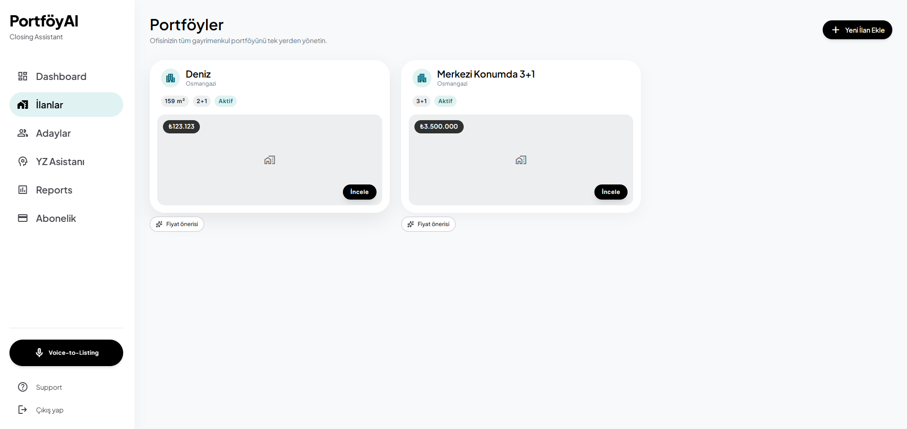

# Takım İsmi
## Takım [151] — PortföyAI

---

# Ürün İle İlgili Bilgiler

## Takım Elemanları

| İsim | Rol |
|------|-----|
| Ömer Faruk Toycu | Product Owner |
| Ömer Faruk Toycu | Scrum Master |
| Ömer Faruk Toycu | Developer |

> Tek kişilik takım — tüm roller aynı kişi tarafından yürütülmektedir.

---

## Ürün İsmi

**PortföyAI** — Emlak Danışmanı için AI Kapanış Asistanı

---

## Ürün Açıklaması

PortföyAI, emlak danışmanının CRM'i değil; ilk WhatsApp mesajından imzaya kadar hiçbir fırsatı kaçırmamasını sağlayan dijital asistanıdır.

Türkiye emlak yazılım pazarında "AI destekli CRM" artık bir farklılaştırıcı değil, sektör standardı (Arveya, RE-OS, EmlakCRMx gibi oyuncular zaten lead skorlama ve AI eşleştirme sunuyor — detaylı rakip analizi için [Girişim Analizi Raporu](./PortfoyAI_Girisim_Analizi_ve_Teknik_Rapor.md)'na bakınız). Bu yüzden PortföyAI, Matching/Scoring/Pricing'i "olması gereken temel özellikler" olarak arkada tutup pazarda gerçekten boş olan iki alana odaklanır: **sesli not ile saniyeler içinde ilan oluşturma** ve **markalı, kapanış aracı olarak kullanılabilecek ulaşım/konum raporu**. Danışman arabada müşteriyle gezerken telefonuna konuşur, PortföyAI ilanı taslak olarak hazırlar; danışman onaylar. Aynı danışman, adayına logolu bir PDF ile "eve 12 dakikada, metroya yürüyerek 4 dakikada" diyen somut bir rapor gönderir. Arka planda WhatsApp'tan gelen her lead otomatik nitelendirilir, skorlanır ve uygun portföylerle eşleştirilir.

> **Önemli netleştirme:** PortföyAI, Sahibinden/Hepsiemlak/Emlakjet gibi ilan portallarıyla arka planda otomatik çalışan bir entegrasyon veya *scraping* mekanizması **içermez** — bu portalların bot korumaları (özellikle Sahibinden'in sunucu taraflı isteklere 403 dönmesi) ve ilişkili yasal risk nedeniyle bilinçli olarak tercih edilmedi. Danışman kendi portföyünü kendisi girer: rehberli bir sihirbazla elle, ya da ilanının sayfa kaynağını kendi tarayıcısından kopyalayıp yapıştırarak (URL ile değil — sunucudan atılan istekler engelleniyor, danışmanın kendi tarayıcısından kopyaladığı HTML ise sorunsuz ayrıştırılıyor). Ürün bir ilan sitesi değil, danışmanın kendi verisi üzerinde çalışan bir asistandır.

Backend + PostgreSQL Railway'de, ofis paneli Vercel'de canlıdır (2026-07-03 itibarıyla). WhatsApp Business ve iyzico entegrasyonları kod tarafında tamamlanmış olup Meta/iyzico'nun kurumsal onay süreçlerinin tamamlanmasını beklemektedir.

---

## Ürün Özellikleri

### Hero Özellikler (Farklılaştırıcı — rakiplerde yok)
- 🎙️ **Sesli Not → İlan Otomasyonu** ✅ — Danışman `/assistant` sayfasında tarayıcıdan mikrofonla kayıt yapar ya da ses dosyası yükler; Gemini'nin native ses girişiyle tek çağrıda transkript + yapılandırılmış ilan taslağı (başlık/bölge/fiyat/oda/m²) üretilir. Danışman taslağı gözden geçirip düzenledikten sonra onaylamadan hiçbir ilan oluşturulmaz.
- 🗺️ **Markalı Ulaşım/Konum Raporu (PDF)** ✅ — Google Maps Directions API ile üretilen, ofis adı başlıklı, araç/yürüyüş/toplu taşıma sürelerini gösteren PDF; ilan detay sayfasından hedef adres girilerek anında indirilir.
- 💬 **WhatsApp Takip Mesajı** 🟡 — Danışman, aday panelinden tek tıkla Meta WhatsApp Cloud API üzerinden takip mesajı gönderebiliyor. Tam otomatik (zamanlanmış/kuralla tetiklenen) takip zinciri henüz yok — bu, manuel tetiklenen MVP versiyonu; ayrıca ofisin bir WhatsApp numarasına bağlı olması gerekiyor.

### Temel Özellikler (Table Stakes — sektör standardı, ürün için zorunlu ama pazarlamanın merkezinde değil)
- 🤖 **Intake Agent** ✅ — WhatsApp Business Cloud API webhook'undan gelen mesajları lead olarak sisteme kaydeder/günceller; Meta'nın en-az-bir-kez teslimatına karşı idempotency ile mükerrer mesajları tekilleştirir. Kod tamam, Meta Business doğrulaması tamamlanana kadar sadece mock payload'larla test edilebiliyor.
- 📋 **İlan İçe Aktarma (Sayfa Kaynağı Yapıştır)** ✅ — Danışman, Sahibinden ilanının sayfa kaynağını (Ctrl+U) kopyalayıp yapıştırır; JSON-LD ve CSS seçicileriyle başlık/bölge/fiyat/oda sayısı/m² otomatik çıkarılıp forma doldurulur. Sunucudan hiçbir dış siteye istek atılmaz.
- 🔗 **Matching Agent** ✅ — Bütçe, oda sayısı ve bölge kriterlerine göre; lead'e yarıçap (`radius_km`) tanımlanmışsa OpenStreetMap Nominatim ile geocode edilmiş coğrafi mesafeye göre eşleştirir
- 📊 **Scoring Agent** ✅ — Yanıt hızı, mesaj sayısı, bütçe tutarlılığı gibi kural bazlı ağırlıklarla lead'i puanlar (ilk versiyon ML değil, kural motoru)
- 💰 **Pricing Agent** ✅ — ChromaDB'de tutulan, ofis-içi bölgesel emsal ilan embedding'leri üzerinden k-NN benzerlik ile "benzer ilan fiyat aralığı" önerir (kesin AI fiyat tahmini değil, savunulabilir bir aralık)
- 📈 **Reports** ✅ — Ofisin portföy/aday verisinden bölge dağılımı, skor dağılımı ve kaynak kırılımı; ek bir API key gerektirmiyor
- 🏢 **Multi-tenant Ofis Yönetimi** ✅ — Ofis sahibi / danışman / görüntüleyici rolleriyle RBAC, PostgreSQL Row-Level Security ile veri izolasyonu
- 💳 **Abonelik ve Faturalama** *(planlanan)* — iyzico Abonelik Yönetimi ile Starter / Professional / Enterprise planları; sandbox aktivasyon maili bekleniyor

---

## Hedef Kitle

- **Birincil hedef:** 1–5 danışmanlı bireysel/mikro emlak ofisleri (büyük zincirler değil — onlar zaten kurumsal CRM'lere bağlı, değişim maliyeti düşük olan küçük ofisler ilk dalga)
- Şu anda WhatsApp ve Excel ile manuel çalışan, dijitalleşmemiş emlak danışmanları
- İl/ilçe bazlı emlakçı WhatsApp gruplarında ve emlak odalarında (TÜGEM, İstanbul Emlak Odası vb.) organik olarak ulaşılabilecek bağımsız acenteler
- Zaman kaybını en çok "sahada not alıp ofise dönünce ilan girme" ve "her lead'i manuel takip etme" adımlarında yaşayan danışmanlar

---

## Kullanılan Teknolojiler

| Katman | Teknoloji | Durum | Gerekçe |
|--------|-----------|-------|---------|
| LLM | Google Gemini (`google-generativeai` SDK, `gemini-2.5-flash`) | ✅ Aktif | Voice-to-Listing: ses dosyasını doğrudan modele göndererek tek çağrıda transkript + yapılandırılmış ilan taslağı üretir. Diğer ajanlar (Matching/Scoring/Pricing) hâlâ kural bazlı/istatistiksel, LLM kullanmıyor |
| Agent Framework | LangGraph | ✅ Aktif | Matching Agent şu an tek node'lu bir graph olarak çalışıyor; çoklu-node genişleme planlı |
| Vektör DB | ChromaDB (yerel varsayılan embedding modeli, API anahtarı gerekmiyor) | ✅ Aktif | Pricing Agent — ofis-içi (tenant-scoped) bölgesel emsal ilan benzerliği |
| Backend | Python 3.11 + FastAPI + SQLAlchemy + Alembic | ✅ Aktif, Railway'de canlı | REST API, migration yönetimi |
| Auth | `python-jose` (JWT) + RBAC | ✅ Aktif | Ofis sahibi / danışman / görüntüleyici rolleri |
| Veritabanı | PostgreSQL (Row-Level Security), Railway managed | ✅ Aktif, canlı | `office_id` bazlı multi-tenant izolasyon |
| Mesajlaşma | WhatsApp Business Cloud API (Meta'ya doğrudan, BSP kullanılmıyor) | 🟡 Kod tamam, Meta doğrulaması bekleniyor | Intake Agent webhook kanalı |
| İlan İçe Aktarma | BeautifulSoup4 + lxml | ✅ Aktif (yalnızca Sahibinden) | Yapıştırılan sayfa kaynağından JSON-LD/CSS seçicilerle alan çıkarımı |
| Konum/Coğrafya | OpenStreetMap Nominatim (ücretsiz, API key gerektirmez) | ✅ Aktif | Bölge → koordinat geocoding, DB önbellek, yarıçap bazlı eşleştirme |
| Dosya Depolama | boto3 + S3-uyumlu servis (Railway Bucket / Tigris) | 🟡 Kurulum aşamasında | İlan fotoğrafı yükleme; bucket public-read doğrulaması bekleniyor |
| Ödeme | iyzico Abonelik Yönetimi (v2 API) | ⏳ Planlanan — sandbox aktivasyonu bekleniyor | Starter/Professional/Enterprise abonelik planları |
| Harita/Rota | Google Maps Directions API | ✅ Aktif, Railway'de canlı | Ulaşım/konum raporu — araç/yürüyüş/toplu taşıma süresi |
| PDF Üretimi | WeasyPrint (native Pango/Cairo bağımlılıkları Dockerfile'a eklendi) | ✅ Aktif | Markalı, logolu ulaşım raporu çıktısı |
| Frontend | Next.js 16 (App Router) + TypeScript + Tailwind CSS | ✅ Aktif, Vercel'de canlı | Ofis paneli — bento-grid dashboard, rehberli (6 adımlı) ilan ekleme sihirbazı |
| Hata İzleme | Sentry | ⏳ Planlanan — DSN henüz eklenmedi | Prod ortamda hata yakalama |
| CI/CD | GitHub Actions (test) + Railway (backend) + Vercel (frontend) | ✅ Aktif | Otomatik test + deploy |
| Versiyon Kontrolü | GitHub | ✅ Aktif | Bu repo |

---

## Ajan Mimarisi

> ✅ = kod tarafında tamamlandı ve test edildi · 🟡 = kod tamam, dış onay/kurulum bekliyor

```
WhatsApp Mesajı 🟡 / Sahibinden Sayfa Kaynağı Yapıştırma ✅ / Manuel Giriş ✅ / Sesli Not ✅
              │
              ▼
     ┌──────────────────────┐
     │ LangGraph              │
     │ Orchestrator           │  ← İstek tipini ayırt eder, ilgili ajana yönlendirir
     └──┬──────┬──────┬──────┘
        │      │      │
        ▼      ▼      ▼
   [Intake]  [Listing   [Matching Agent] ✅
   Agent 🟡   Import      (bölge ya da Nominatim
        │     Agent ✅     ile geocode edilmiş
        │     (Sahibinden   yarıçap filtresi)
        │      paste)           │
        │      │                ▼
        │      │          [Scoring Agent] ✅
        │      │                │
        │      │                ▼
        │      │          [Pricing Agent] ✅
        │      │                │
        └──────┴──────┬─────────┘
                       ▼
              ┌──────────────────┐
              │  CRM Katmanı      │  ← Lead/portföy kaydı, skor, eşleşme, fotoğraf (S3) 🟡
              └────────┬─────────┘
                       │
                       ▼
        Ofis Paneli (Next.js, Vercel'de canlı) ✅
        + Voice-to-Listing Agent ✅ + Ulaşım Raporu (PDF) ✅
        + WhatsApp Takip Mesajı (manuel tetiklenen) 🟡
```

**Intake Agent 🟡:** Meta WhatsApp Cloud API webhook'undan gelen mesajları lead olarak kaydeder/günceller (şu an kural bazlı, LLM ayrıştırma yok); `X-Hub-Signature-256` HMAC doğrulaması ve idempotency ile mükerrer mesajları engeller. Kod ve testler tamam, Meta Business doğrulaması tamamlanana kadar canlı numarayla çalışmıyor.

**Listing Import Agent ✅:** Danışmanın kendi tarayıcısından kopyaladığı Sahibinden sayfa kaynağını JSON-LD + CSS seçicileriyle ayrıştırıp ilan formunu otomatik doldurur; sunucudan hiçbir dış siteye istek atılmaz. Seçiciler henüz gerçek yapıştırılmış kaynaklarla doğrulanmadı.

**Matching Agent ✅:** Lead kriterlerini (bütçe, oda sayısı, bölge) mevcut portföylerle eşleştirir; `radius_km` set edilmişse bölge string eşleşmesi yerine Nominatim ile geocode edilmiş coğrafi yarıçap filtresi uygular.

**Scoring Agent ✅:** Kural bazlı ağırlıklı skor üretir — yanıt hızı (%40) + mesaj sayısı (%30) + bütçe tutarlılığı (%30)

**Pricing Agent ✅:** ChromaDB'deki ofis-içi (tenant-scoped) emsal ilan embedding'leri üzerinden k-NN benzerlik ile fiyat aralığı önerir

**Voice-to-Listing Agent ✅:** Gemini'nin native ses girişiyle tek çağrıda transkript + yapılandırılmış ilan taslağı üretir; danışman onaylayıp `/listings`'e göndermeden hiçbir ilan oluşturulmaz

**Location Report Agent ✅:** Google Maps Directions API ile portföyden hedef adrese araç/yürüyüş/toplu taşıma sürelerini alır, WeasyPrint ile markalı bir PDF'e dönüştürür

**WhatsApp Send 🟡:** Danışmanın panelden tek tıkla tetiklediği, Meta Cloud API üzerinden giden takip mesajı; ofisin `whatsapp_phone_number_id`'si set edilmemişse çalışmaz. Tam otomatik (zamanlanmış) takip zinciri henüz yok

---

## İş Modeli Notu

Starter / Professional / Enterprise üç kademeli abonelik modeli. Starter plana WhatsApp AI erişimi tamamen kapatılmaz — sınırlı sayıda konuşma (örn. ayda 100) dahil edilir ki deneme kullanıcısı ürünün asıl değerini (Intake Agent) görebilsin. 14 günlük deneme, iyzico akışı gereği kart bilgisi doğrulaması ister ancak deneme boyunca ücret alınmaz. Detaylı unit economics ve rakip analizi için [Girişim Analizi Raporu](./PortfoyAI_Girisim_Analizi_ve_Teknik_Rapor.md)'na bakınız.

---

## Teknik Yol Haritası

Detaylı, story bazlı teknik yol haritası ve altyapı kararları için: [📋 TEKNIK_YOL_HARITASI.md](./TEKNIK_YOL_HARITASI.md)

---

## Product Backlog URL

[📋 GitHub Projects — PortföyAI Backlog](https://github.com/omertoycu/YZTA-BOOTCAMP/projects/1)

> *Alternatif: [Miro Backlog Board](#)*

---

# Sprint 1

> 📅 **19 Haziran — 5 Temmuz 2026**
> Sprint puanı hedefi: `31`
>
> ⚠️ **Pivot notu:** Ürün konsepti (EvRadar → PortföyAI) Sprint 1 içerisinde, sprint bitimine 3 gün kala netleşmiştir. Aşağıdaki story seçimi, kalan süreye göre gerçekçi şekilde daraltılmış temel iskelete odaklanır; kapsamlı özellikler Sprint 2/3'e devredilmiştir.

### Backlog Düzeni ve Story Seçimleri

Sprint 1'de hedef, ürünün çalışan ama minimal iskeletini kurmak: multi-tenant auth, temel portföy CRUD'u, ilk Matching Agent taslağı ve ödeme/CI altyapısının başlatılması.

**Sprint 1 User Story'leri:**

| # | User Story | Puan |
|---|-----------|------|
| 1 | Ofis olarak kayıt olabilmeli, JWT ile giriş yapabilmeliyim (FastAPI + `python-jose`) | 8 |
| 2 | Sistem, her tabloda `office_id` bazlı PostgreSQL RLS ile veri izolasyonu sağlamalı | 5 |
| 3 | Danışman olarak portföy (ilan) manuel ekleyip listeleyebilmeliyim | 5 |
| 4 | Matching Agent MVP: bütçe aralığı + oda sayısı + bölge filtresiyle basit eşleştirme (LangGraph tek node) | 8 |
| 5 | iyzico sandbox aktivasyon talebi gönderilmeli ve GitHub Actions CI/CD (Railway deploy) kurulmalı | 5 |

**Sprint Toplam Tahmini Puan: 31**

### Daily Scrum

Daily Scrum Slack kanalı üzerinden asenkron olarak yürütülmektedir (her üye günlük 3 soruyu yanıtlar).

> 📎 [Sprint 1 Daily Scrum Notları](./ProjectManagement/Sprint1Documents/DailyScrumNotes_Sprint1.md)

### Sprint Board Güncellemeleri

> 📸 *Sprint bitiminde ekran görüntüleri eklenecektir.*
> 

### Ürün Durumu

> 📸 *Uygulama ekran görüntüleri eklenecektir.*
> 

### Sprint Review

**Katılımcılar:** Ömer Faruk Toycu (tek kişilik takım — Product Owner / Scrum Master / Developer)

**Tamamlanan Story'ler:**
- [x] Ofis kaydı + JWT auth
- [x] Multi-tenant RLS (docker-compose ile uçtan uca test edildi; superuser bypass, transaction-scoped context ve cross-tenant login sorunları tespit edilip düzeltildi — bkz. [TEKNIK_YOL_HARITASI.md](./TEKNIK_YOL_HARITASI.md))
- [x] Portföy CRUD (create + list)
- [x] Matching Agent MVP
- [x] GitHub Actions CI/CD (pytest + ruff, Postgres servisli)
- [ ] iyzico sandbox aktivasyon talebi — **manuel aksiyon gerekiyor**, henüz gönderilmedi
- [ ] WhatsApp Business doğrulama başvurusu — **manuel aksiyon gerekiyor**, henüz başlatılmadı
- [ ] Railway'e gerçek deploy — CI'da build/test var, henüz canlı deploy adımı yok

**Sonraki Sprint'e Devreden:**
iyzico sandbox aktivasyonu ve WhatsApp Business başvurusu kurumsal/manuel işlemler olduğu için Sprint 2'ye devrediyor; bu ikisi Sprint 2'nin ilk gününde paralel başlatılmalı (bkz. TEKNIK_YOL_HARITASI.md Bölüm 5). Railway deploy'u da Sprint 2 kapsamına alındı.

**Alınan Kararlar:**
RLS testinde ortaya çıkan üç güvenlik açığı (superuser bypass, SET LOCAL'in transaction-scoped olması, login'in cross-tenant sorgu ihtiyacı) kod incelemesiyle değil gerçek Docker ortamında uçtan uca test ederek bulundu — bundan sonraki her multi-tenant değişiklikte aynı testin (`backend/tests/test_rls.py`) CI'da çalışması zorunlu tutulacak.

### Sprint Retrospective

**Ne iyi gitti?**
- Pivot kararı (EvRadar → PortföyAI) sprint bitimine 3 gün kala alınmasına rağmen README, teknik yol haritası ve backend iskeleti aynı gün yeniden yazılıp kapsam gerçekçi şekilde daraltıldı; sprint hedefine (31 puan) rağmen çalışan bir iskelet teslim edildi.
- RLS güvenlik testleri kod incelemesiyle değil gerçek Docker/Postgres ortamında uçtan uca yapıldı; bu sayede üç kritik açık (superuser'ların RLS'i atlaması, `SET LOCAL`'in transaction-scoped olması, login'in cross-tenant e-posta arama ihtiyacı) production'a çıkmadan bulunup düzeltildi.

**Ne geliştirilmeli?**
- Sprint planlaması pivot riskini hesaba katmadığı için kapsam son 3 günde acil daraltılmak zorunda kaldı; iyzico ve WhatsApp Business gibi manuel/kurumsal onay gerektiren adımlar sprint başında değil sprint sonunda fark edildi.
- Tek kişilik takım olması code review/pair programming imkânı bırakmıyor; RLS açıkları ancak uçtan uca testle yakalanabildi, statik incelemeyle değil — bu durum ileride başka güvenlik açıklarını da gözden kaçırma riski taşıyor.

**Aksiyon Maddeleri:**
- Manuel onay gerektiren dış entegrasyonlar (iyzico, WhatsApp Business) her sprint'in ilk gününde, kod işine paralel olarak başlatılacak (Sprint 2'de uygulandı, bkz. aşağı).
- Multi-tenant/RLS'e dokunan her değişiklikte `backend/tests/test_rls.py`'nin CI'da zorunlu koşulması karara bağlandı.

---

# Sprint 2

> 📅 **6 Temmuz — 19 Temmuz 2026**

### Backlog Düzeni ve Story Seçimleri

Sprint 2'de gerçek entegrasyonları (ödeme, WhatsApp) ve Pricing/Scoring ajanlarını tamamlamayı hedefliyoruz.

> ⚡ **Erken başlangıç notu (2–4 Temmuz 2026, sprint resmi olarak 6 Temmuz'da başlıyor):** Sprint 1 kapanışının hemen ardından, resmi tarih beklenmeden aşağıdaki tabloda listelenen Sprint 2 story'lerinin çoğu, backlog'da hiç yer almayan ek kapsam (ilan içe aktarma, konum bazlı eşleştirme, fotoğraf yükleme, tasarım sistemi yenilemesi, ilan detay sayfası, Reports) ve normalde Sprint 3'e ait iki hero özellik (Voice-to-Listing, Ulaşım Raporu) kod tarafında tamamlandı. Backend + PostgreSQL Railway'de, ofis paneli Vercel'de canlıya alındı (2026-07-03), Gemini/Google Maps entegrasyonları canlı ortama eklendi (2026-07-04). 70 backend testi yeşil, ruff lint temiz — gerçek pytest suite'i izole bir Docker+Postgres ortamında doğrulandı (bu süreçte WeasyPrint'in `pydyf` 0.12 ile kırılan uyumluluğu ve Railway'in Debian trixie tabanında `libgdk-pixbuf` paket adı değişikliği bulunup düzeltildi). Detaylar için [TEKNIK_YOL_HARITASI.md](./TEKNIK_YOL_HARITASI.md) ve [CLAUDE.md](./CLAUDE.md)'ye bakınız.

**Planlanan Story'ler:**

| # | User Story | Puan (Tahmini) | Durum |
|---|-----------|----------------|-------|
| 6 | iyzico canlı ödeme akışı: ürün + 3 `pricingPlan` (Starter/Professional/Enterprise) | 8 | ⏳ Beklemede — iyzico sandbox aktivasyon maili gerekiyor (manuel, `entegrasyon@iyzico.com`) |
| 7 | WhatsApp Business API başvurusu + BSP seçimi + Intake Agent webhook entegrasyonu | 8 | 🟡 Webhook kodu tamam (HMAC imza doğrulama, idempotency, prod'da secret zorunlu); Meta Business Manager doğrulaması bekleniyor (manuel) |
| 8 | Pricing Agent: ChromaDB emsal embedding + k-NN benzerlik ile fiyat aralığı önerisi | 8 | ✅ Tamamlandı *(erken)* |
| 9 | Scoring Agent: kural bazlı skor motoru (yanıt hızı + mesaj sayısı + bütçe tutarlılığı) | 5 | ✅ Tamamlandı *(erken)* |
| 10 | Ofis paneli (Next.js): lead listesi + portföy yönetimi temel ekranları | 8 | ✅ Tamamlandı, ardından tasarım sistemi tamamen yenilendi (bkz. aşağı) |

**Sprint içinde ortaya çıkan ek kapsam** (orijinal backlog'da yoktu, resmi sprint tarihinden önce tamamlandı):

| Kapsam | Durum |
|--------|-------|
| Sahibinden sayfa kaynağı yapıştır → ilan formu otomatik doldur (JSON-LD + CSS seçiciler) | ✅ Kod tamam; seçiciler gerçek yapıştırılmış kaynaklarla henüz doğrulanmadı |
| Konum/yarıçap bazlı eşleştirme (Nominatim geocoding + DB önbellek) | ✅ Tamamlandı; `radius_km` set edilmezse eski bölge-eşleşmesine geriye dönük uyumlu |
| İlan fotoğrafı yükleme (S3-uyumlu depo, dosya boyutu/tür doğrulaması) | 🟡 Kod tamam; Railway Bucket (Tigris) kurulumu ve public-read doğrulaması devam ediyor |
| Yeni tasarım sistemi: bento-grid dashboard + rehberli (6 adımlı) ilan ekleme sihirbazı | ✅ Tamamlandı |
| Production deployment (Railway backend+DB, Vercel frontend) — orijinalde Sprint 3 story'siydi (#14), erken taşındı | ✅ Canlı; kalan: Sentry DSN, ChromaDB kalıcı disk (Volume) |
| İlan detay sayfası (`/listings/[id]`) — "İncele" butonu önceden kendi sayfasına link veriyordu, hiçbir etkisi yoktu | ✅ Tamamlandı |
| Voice-to-Listing: Gemini native ses girişiyle sesli not → ilan taslağı — orijinalde Sprint 3 story'siydi (#11), erken taşındı, Whisper'a gerek kalmadı | ✅ Canlı |
| Markalı Ulaşım/Konum Raporu (PDF) — orijinalde Sprint 3 story'siydi (#12), erken taşındı | ✅ Canlı |
| WhatsApp takip mesajı (manuel tetiklenen giden mesaj) — orijinalde Sprint 3 story'sinin (#13) bir parçası | 🟡 Kod tamam; ofisin WhatsApp numarasına bağlı olması gerekiyor |
| Reports sayfası: bölge/skor/kaynak dağılımı | ✅ Tamamlandı |

### Daily Scrum

> 📎 [Sprint 2 Daily Scrum Notları](./ProjectManagement/Sprint2Documents/DailyScrumNotes_Sprint2.md)

### Sprint Board Güncellemeleri

*Sprint devam ediyor (bitiş: 19 Temmuz 2026) — ekran görüntüleri sprint sonunda eklenecektir.*

### Ürün Durumu

*Sprint devam ediyor — ekran görüntüleri sprint sonunda eklenecektir. Bu arada canlı ortamlar: backend Railway'de, ofis paneli Vercel'de.*

### Sprint Review

*Sprint devam ediyor (bitiş: 19 Temmuz 2026) — sprint bitiminde doldurulacaktır.*

### Sprint Retrospective

*Sprint bitiminde doldurulacaktır.*

---

# Sprint 3

> 📅 **20 Temmuz — 2 Ağustos 2026**

### Backlog Düzeni ve Story Seçimleri

Sprint 3'te hero özelliklerin geri kalanını (Otomatik Takip zinciri) canlıya almayı ve deployment/polish adımlarını hedefliyoruz. Voice-to-Listing ve Ulaşım Raporu, resmi Sprint 3 tarihinden önce Sprint 2 kapsamında erken tamamlandı (bkz. yukarısı).

**Planlanan Story'ler (Taslak):**

| # | User Story | Puan (Tahmini) |
|---|-----------|----------------|
| 11 | ~~Voice-to-Listing: Whisper transkripsiyon + Gemini ile ilan taslağı~~ **Sprint 2'de erken tamamlandı** — Gemini native ses girişiyle, Whisper'a gerek kalmadan | 8 |
| 12 | ~~Markalı ulaşım/konum raporu: Google Maps Directions API + WeasyPrint PDF üretimi~~ **Sprint 2'de erken tamamlandı** | 5 |
| 13 | Otomatik WhatsApp takip mesajı zinciri — manuel tetiklenen giden mesaj (`/leads/{id}/follow-up`) Sprint 2'de erken tamamlandı; kalan kapsam: zamanlanmış/kural bazlı otomatik tetikleme (scheduler) | 5 |
| 14 | ~~Production deployment: Railway/Render~~ **Railway+Vercel deploy'u Sprint 2'de erken tamamlandı** — kalan kapsam: Sentry hata izleme + retry/timeout mekanizmaları | 5 |
| 15 | Onboarding'de zorunlu veri kalitesi kontrolü (eksik/tutarsız portföy girişini engelleme) | 3 |

### Daily Scrum

> 📎 [Sprint 3 Daily Scrum Notları](./ProjectManagement/Sprint3Documents/DailyScrumNotes_Sprint3.md)

### Sprint Board Güncellemeleri

*Ekran görüntüleri eklenecektir.*

### Ürün Durumu

*Ekran görüntüleri eklenecektir.*

### Sprint Review

*Sprint bitiminde doldurulacaktır.*

### Sprint Retrospective

*Sprint bitiminde doldurulacaktır.*

---

## Lisans

Bu proje YZTA Bootcamp 2026 kapsamında geliştirilmiştir. © Takım [151]
