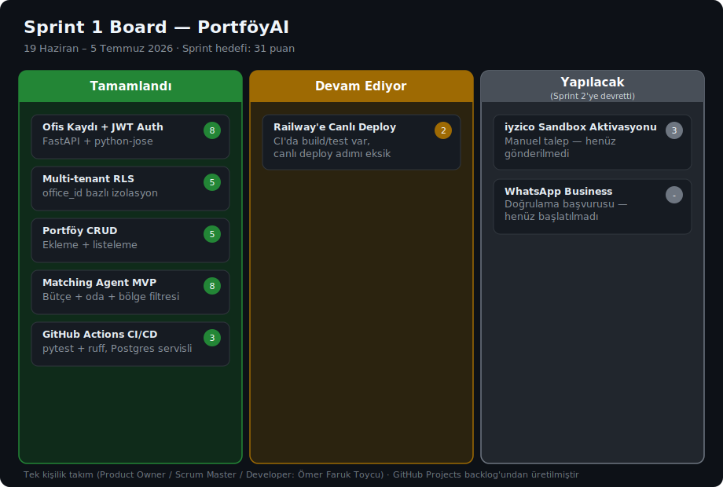
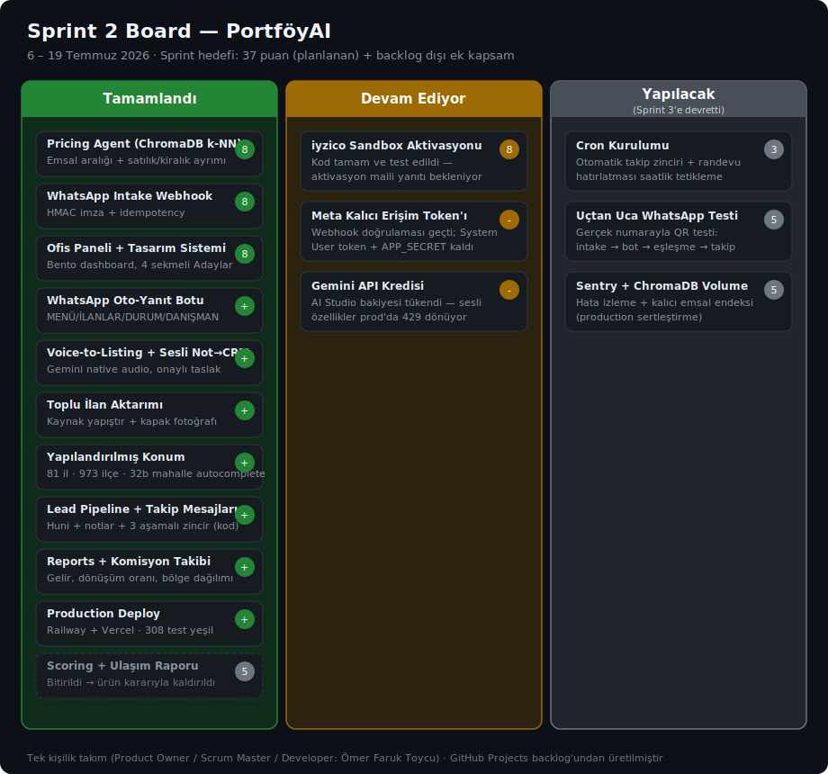
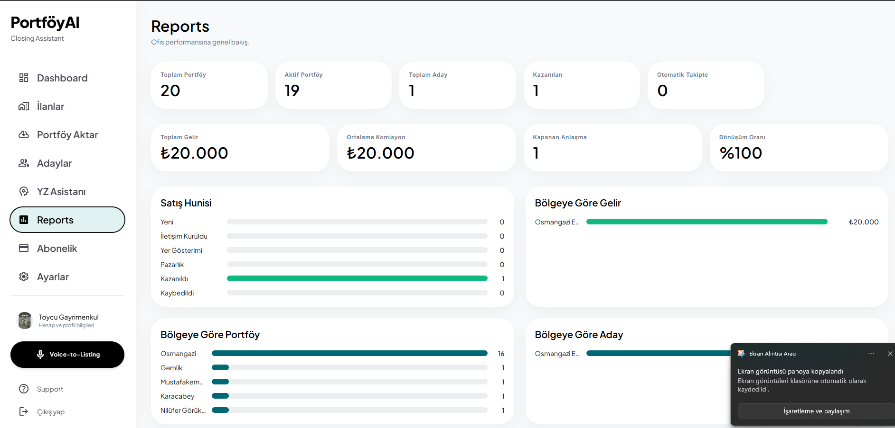

# Takım İsmi
## Takım [151] — PortföyAI

---

# Ürün İle İlgili Bilgiler

## Takım Elemanları

| İsim | Rol |
|------|-----|
| Ömer Faruk Toycu | Product Owner |
| Ömer Faruk Toycu | Scrum Master |
| Ömer Faruk Toycu | Developer |

> Tek kişilik takım — tüm roller aynı kişi tarafından yürütülmektedir.

---

## Ürün İsmi

**PortföyAI** — Emlak Danışmanı için AI Kapanış Asistanı

---

## Ürün Açıklaması

PortföyAI, emlak danışmanlarının WhatsApp'tan gelen hiçbir müşteriyi kaçırmadan, doğru alıcıyı doğru portföyle buluşturmasını sağlayan bir yapay zeka asistanıdır. Klasik bir CRM değildir; danışmanın günlük işini — ilan girmekten müşteri takibine kadar — hızlandıran bir yardımcıdır.

Danışman portföyünü kendisi ekler: sesle anlatarak, rehberli bir formla ya da ilan sayfasının kaynağını yapıştırarak. Sistem gelen her müşteri mesajını otomatik değerlendirir, uygun portföylerle eşleştirir ve takibi asla unutmaz. Danışman isterse WhatsApp otomatik yanıt botunu açar: sık sorular anında yanıtlanır, kriterleri netleşen adaya uygun portföyler otomatik gönderilir.

> **Not:** PortföyAI, ilan sitelerini (Sahibinden, Hepsiemlak, Emlakjet vb.) arka planda otomatik tarayan bir sistem değildir. Danışman kendi portföyünü kendisi girer; bu hem yasal riskleri ortadan kaldırır hem de veri kalitesini danışmanın kontrolünde tutar.

Backend Railway'de, ofis paneli Vercel'de canlıdır.

---

## Ürün Özellikleri

### Öne Çıkan Özellikler (rakiplerde olmayan)
- 🎙️ **Sesli Not → İlan** ✅ — Danışman telefonuna konuşur; yapay zeka kaydı dinleyip ilan taslağını (başlık, bölge, fiyat, oda sayısı, m²) otomatik hazırlar. Danışman onaylamadan hiçbir ilan yayınlanmaz.
- 🎙️ **Sesli Not → CRM Güncellemesi** ✅ — Bir aday hakkındaki görüşmeyi sesli anlatır; yapay zeka görüşme özeti, önerilen pipeline durumu ve hatırlatma taslağı hazırlar. Onay olmadan hiçbir şey yazılmaz.
- 💬 **WhatsApp Otomatik Yanıt Botu** 🟡 — Danışman botu açtığında MENÜ/İLANLAR/DURUM/DANIŞMAN komutları anında (yapay zeka maliyeti olmadan) yanıtlanır, yeni adaya her koşulda karşılama mesajı gider, kriterleri netleşen adaya uygun portföyler otomatik gönderilir. Kod hazır, WhatsApp hattının kalıcı erişim izni bekleniyor.
- 💬 **Otomatik WhatsApp Takip Zinciri** 🟡 — Danışman "Otomatik Takip"i açtığında sistem müşteriye 1., 3. ve 7. günlerde giderek yumuşayan hatırlatma mesajları gönderir; müşteri yanıt verdiği an zincir otomatik durur. Kod hazır, WhatsApp hattının kalıcı erişim izni bekleniyor.

### Temel Özellikler (sektörde standart, ürünün olmazsa olmazı)
- 🤖 **Müşteri Kaydı** ✅ — WhatsApp'tan gelen mesajlar otomatik olarak müşteri kaydına dönüşür; adayın adı WhatsApp profilinden yakalanır, danışmana yeni aday anlık bildirimi gider.
- 📋 **Toplu İlan Aktarımı** ✅ — Danışman kendi tarayıcısından ilan sayfasının kaynağını yapıştırır; tüm ilanlar başlık, konum (il/ilçe/mahalle), fiyat, oda sayısı, m² ve kapak fotoğrafıyla inceleme kartlarına dökülür, onaylananlar içeri alınır.
- 🔗 **Eşleştirme** ✅ — Müşterinin bütçesi (±%5 tolerans), oda tercihi ve bölgesine (mahalle dahil, istenirse yarıçap bazlı) göre uygun portföyleri bulur.
- 💰 **Fiyat Önerisi** ✅ — Benzer portföylerin emsallerine bakarak (satılık/kiralık ayrımıyla) savunulabilir bir fiyat aralığı önerir.
- 📈 **Raporlama** ✅ — Ofisin verisinden satış hunisi, bölge/kaynak dağılımı, toplam gelir, ortalama komisyon ve dönüşüm oranını özetler.
- 🏢 **Çoklu Ofis Desteği** ✅ — Her ofisin verisi diğerlerinden tamamen izole tutulur (rol bazlı erişim: sahip / danışman / görüntüleyici).
- 💳 **Abonelik ve Faturalama** 🟡 — Üç plan arasından (Başlangıç / Profesyonel / Ofis) seçim yapılıp güvenli ödeme sayfası üzerinden abone olunur. Kod hazır, ödeme sağlayıcısının sandbox aktivasyonu bekleniyor.

---

## Hedef Kitle

- 1–5 danışmanlı bağımsız emlak ofisleri
- Hâlâ WhatsApp ve Excel ile manuel çalışan, dijitalleşmemiş emlak danışmanları
- İlan girme ve müşteri takibinde en çok zaman kaybeden, sahada çalışan danışmanlar

---

## Kullanılan Teknolojiler

| Katman | Teknoloji | Durum | Gerekçe |
|--------|-----------|-------|---------|
| LLM | Google Gemini (`google-generativeai` SDK, `gemini-2.5-flash`) | ✅ Aktif | Voice-to-Listing ve Sesli Not → CRM: ses dosyası doğrudan modele gider, tek çağrıda transkript + yapılandırılmış taslak. WhatsApp yanıt taslakları ve web-araştırmalı fiyat aralığı da aynı modeli kullanır (tüm çağrılarda katmanlı çıktı limiti — maliyet kontrolü). Matching/Pricing ajanları kural bazlı/istatistiksel, LLM kullanmıyor |
| Agent Framework | LangGraph | ✅ Aktif | Matching Agent şu an tek node'lu bir graph olarak çalışıyor; çoklu-node genişleme planlı |
| Vektör DB | ChromaDB (yerel varsayılan embedding modeli, API anahtarı gerekmiyor) | ✅ Aktif | Pricing Agent — ofis-içi (tenant-scoped) bölgesel emsal ilan benzerliği |
| Backend | Python 3.11 + FastAPI + SQLAlchemy + Alembic | ✅ Aktif, Railway'de canlı | REST API, migration yönetimi |
| Auth | `python-jose` (JWT) + RBAC | ✅ Aktif | Ofis sahibi / danışman / görüntüleyici rolleri |
| Veritabanı | PostgreSQL (Row-Level Security), Railway managed | ✅ Aktif, canlı | `office_id` bazlı multi-tenant izolasyon |
| Mesajlaşma | WhatsApp Business Cloud API (Meta'ya doğrudan, BSP kullanılmıyor) | 🟡 Kod tamam; webhook doğrulaması geçti, kalıcı erişim token'ı bekleniyor | Intake Agent webhook kanalı + otomatik yanıt botu + takip mesajları |
| İlan İçe Aktarma | BeautifulSoup4 + lxml | ✅ Aktif (Sahibinden) | Yapıştırılan sayfa kaynağından JSON-LD/CSS seçicilerle toplu alan çıkarımı; gerçek mağaza verisiyle doğrulandı |
| Konum/Coğrafya | Repo'ya gömülü Türkiye il/ilçe/mahalle sözlüğü + OpenStreetMap Nominatim (ücretsiz, API key gerektirmez) | ✅ Aktif | Şehir→ilçe→mahalle autocomplete, ilçeden şehir çıkarımı; geocoding + DB önbellek ile yarıçap bazlı eşleştirme |
| Dosya Depolama | boto3 + S3-uyumlu servis (Railway Bucket) | ✅ Aktif | İlan fotoğrafı + ofis logosu; bucket public erişim desteklemediği için dosyalar backend proxy üzerinden sunuluyor |
| Ödeme | iyzico Abonelik Yönetimi (v2 API) | 🟡 Kod tamam — sandbox aktivasyonu bekleniyor | Başlangıç/Profesyonel/Ofis abonelik planları (Checkout Form) |
| Frontend | Next.js 16 (App Router) + TypeScript + Tailwind CSS | ✅ Aktif, Vercel'de canlı | Ofis paneli — bento-grid dashboard, rehberli ilan ekleme sihirbazı, mobil/responsive |
| Hata İzleme | Sentry | ⏳ Planlanan — DSN henüz eklenmedi | Prod ortamda hata yakalama |
| CI/CD | GitHub Actions (test) + Railway (backend) + Vercel (frontend) | ✅ Aktif | Otomatik test + deploy |
| Versiyon Kontrolü | GitHub | ✅ Aktif | Bu repo |

---

## Ajan Mimarisi

> ✅ = kod tarafında tamamlandı ve test edildi · 🟡 = kod tamam, dış onay/kurulum bekliyor

```
WhatsApp Mesajı 🟡 / Sayfa Kaynağı Yapıştırma (toplu) ✅ / Manuel Giriş ✅ / Sesli Not ✅
              │
              ▼
     ┌──────────────────────┐
     │ LangGraph              │
     │ Orchestrator           │  ← İstek tipini ayırt eder, ilgili ajana yönlendirir
     └──┬──────┬──────┬──────┘
        │      │      │
        ▼      ▼      ▼
   [Intake]  [Listing    [Matching Agent] ✅
   Agent 🟡   Import       (bölge/mahalle ya da
      +       Agent ✅      Nominatim ile geocode
   [Oto-Yanıt (toplu        edilmiş yarıçap filtresi)
    Botu 🟡]  kaynak            │
        │     yapıştır)         ▼
        │      │          [Pricing Agent] ✅
        │      │           (satılık/kiralık ayrımlı
        │      │            emsal k-NN benzerliği)
        └──────┴──────┬─────────┘
                       ▼
              ┌──────────────────┐
              │  CRM Katmanı      │  ← Aday/portföy kaydı, pipeline, notlar, eşleşme, fotoğraf (S3) ✅
              └────────┬─────────┘
                       │
                       ▼
        Ofis Paneli (Next.js, Vercel'de canlı) ✅
        + Voice-to-Listing Agent ✅ + Sesli Not → CRM ✅
        + WhatsApp Takip Mesajları (manuel + otomatik 3 aşamalı zincir) 🟡
```

**Intake Agent 🟡:** Meta WhatsApp Cloud API webhook'undan gelen mesajları aday kaydına dönüştürür/günceller, adayın adını WhatsApp profilinden yakalar ve danışmana yeni aday bildirimi gönderir; `X-Hub-Signature-256` HMAC doğrulaması ve idempotency ile mükerrer mesajları engeller. Kod ve testler tamam, webhook doğrulaması geçti — kalıcı erişim token'ı alınana kadar canlı numarayla çalışmıyor.

**WhatsApp Oto-Yanıt Botu 🟡:** Ofis bazında açılıp kapanabilen otomatik yanıt katmanı — MENÜ/İLANLAR/DURUM/DANIŞMAN komutları tamamen deterministik yanıtlanır (LLM maliyeti sıfır), yeni adaya her koşulda karşılama+kısayol mesajı gider, arama kriterleri netleşince Matching Agent'ın gerçek eşleşmeleri otomatik gönderilir; alakasız mesajlara sessiz kalır. Gelen mesaj başına en fazla 1 LLM çağrısı yapılır (maliyet kalkanı).

**Listing Import Agent ✅:** Danışmanın kendi tarayıcısından kopyaladığı Sahibinden sayfa kaynağını JSON-LD + CSS seçicileriyle ayrıştırıp ilanları inceleme kartlarına döker; onaylananlar kapak fotoğrafıyla içeri alınır. Sunucudan ilan sitesine istek atılmaz; gerçek mağaza verisiyle uçtan uca doğrulandı.

**Matching Agent ✅:** Aday kriterlerini (bütçe ±%5 tolerans, oda sayısı, bölge/mahalle) mevcut portföylerle eşleştirir; `radius_km` set edilmişse bölge string eşleşmesi yerine Nominatim ile geocode edilmiş coğrafi yarıçap filtresi uygular.

**Pricing Agent ✅:** ChromaDB'deki ofis-içi (tenant-scoped) emsal ilan embedding'leri üzerinden, satılık/kiralık ayrımıyla k-NN benzerlik ile fiyat aralığı önerir; endeks her deploy sonrası otomatik yeniden kurulur (self-heal).

**Voice-to-Listing Agent ✅:** Gemini'nin native ses girişiyle tek çağrıda transkript + yapılandırılmış ilan taslağı üretir; danışman onaylayıp `/listings`'e göndermeden hiçbir ilan oluşturulmaz.

**Sesli Not → CRM Agent ✅:** Aynı ses altyapısıyla, bir aday hakkındaki sesli notu görüşme özeti + önerilen pipeline durumu + hatırlatma taslağına çevirir; danışman onaylamadan hiçbir kayıt yazılmaz.

**WhatsApp Send 🟡:** Danışmanın panelden tek tıkla tetiklediği takip mesajı + cron ile tetiklenen otomatik 3 aşamalı takip zinciri (+1g/+3g/+7g, aday yanıt verince durur). Kod tamam; kalıcı token + cron kurulumu Sprint 3'te.

---

## İş Modeli Notu

Başlangıç / Profesyonel / Ofis üç kademeli abonelik modeli. Starter plana WhatsApp AI erişimi tamamen kapatılmaz — sınırlı sayıda konuşma (örn. ayda 100) dahil edilir ki deneme kullanıcısı ürünün asıl değerini (Intake Agent) görebilsin. 14 günlük deneme, iyzico akışı gereği kart bilgisi doğrulaması ister ancak deneme boyunca ücret alınmaz. Detaylı unit economics ve rakip analizi için [Girişim Analizi Raporu](./PortfoyAI_Girisim_Analizi_ve_Teknik_Rapor.md)'na bakınız.

---

## Teknik Yol Haritası

Detaylı, story bazlı teknik yol haritası ve altyapı kararları için: [📋 TEKNIK_YOL_HARITASI.md](./TEKNIK_YOL_HARITASI.md)

---

## Product Backlog URL

[📋 GitHub Projects — PortföyAI Backlog](https://github.com/omertoycu/YZTA-BOOTCAMP/projects/1)

> *Alternatif: [Miro Backlog Board](#)*

---

# Sprint 1

> 📅 **19 Haziran — 5 Temmuz 2026**
> Sprint puanı hedefi: `31`
>
> ⚠️ **Pivot notu:** Ürün konsepti (EvRadar → PortföyAI) Sprint 1 içerisinde, sprint bitimine 3 gün kala netleşmiştir. Aşağıdaki story seçimi, kalan süreye göre gerçekçi şekilde daraltılmış temel iskelete odaklanır; kapsamlı özellikler Sprint 2/3'e devredilmiştir.

### Backlog Düzeni ve Story Seçimleri

Sprint 1'de hedef, ürünün çalışan ama minimal iskeletini kurmak: multi-tenant auth, temel portföy CRUD'u, ilk Matching Agent taslağı ve ödeme/CI altyapısının başlatılması.

**Sprint 1 User Story'leri:**

| # | User Story | Puan |
|---|-----------|------|
| 1 | Ofis olarak kayıt olabilmeli, JWT ile giriş yapabilmeliyim (FastAPI + `python-jose`) | 8 |
| 2 | Sistem, her tabloda `office_id` bazlı PostgreSQL RLS ile veri izolasyonu sağlamalı | 5 |
| 3 | Danışman olarak portföy (ilan) manuel ekleyip listeleyebilmeliyim | 5 |
| 4 | Matching Agent MVP: bütçe aralığı + oda sayısı + bölge filtresiyle basit eşleştirme (LangGraph tek node) | 8 |
| 5 | iyzico sandbox aktivasyon talebi gönderilmeli ve GitHub Actions CI/CD (Railway deploy) kurulmalı | 5 |

**Sprint Toplam Tahmini Puan: 31**

### Daily Scrum

Daily Scrum Slack kanalı üzerinden asenkron olarak yürütülmektedir (her üye günlük 3 soruyu yanıtlar).

> 📎 [Sprint 1 Daily Scrum Notları](./ProjectManagement/Sprint1Documents/DailyScrumNotes_Sprint1.md)

### Sprint Board Güncellemeleri



### Ürün Durumu


### Sprint Review

**Katılımcılar:** Ömer Faruk Toycu (tek kişilik takım — Product Owner / Scrum Master / Developer)

**Tamamlanan Story'ler:**
- [x] Ofis kaydı + JWT auth
- [x] Multi-tenant RLS (docker-compose ile uçtan uca test edildi; superuser bypass, transaction-scoped context ve cross-tenant login sorunları tespit edilip düzeltildi — bkz. [TEKNIK_YOL_HARITASI.md](./TEKNIK_YOL_HARITASI.md))
- [x] Portföy CRUD (create + list)
- [x] Matching Agent MVP
- [x] GitHub Actions CI/CD (pytest + ruff, Postgres servisli)
- [ ] iyzico sandbox aktivasyon talebi — **manuel aksiyon gerekiyor**, henüz gönderilmedi
- [ ] WhatsApp Business doğrulama başvurusu — **manuel aksiyon gerekiyor**, henüz başlatılmadı
- [ ] Railway'e gerçek deploy — CI'da build/test var, henüz canlı deploy adımı yok

**Sonraki Sprint'e Devreden:**
iyzico sandbox aktivasyonu ve WhatsApp Business başvurusu kurumsal/manuel işlemler olduğu için Sprint 2'ye devrediyor; bu ikisi Sprint 2'nin ilk gününde paralel başlatılmalı (bkz. TEKNIK_YOL_HARITASI.md Bölüm 5). Railway deploy'u da Sprint 2 kapsamına alındı.

**Alınan Kararlar:**
RLS testinde ortaya çıkan üç güvenlik açığı (superuser bypass, SET LOCAL'in transaction-scoped olması, login'in cross-tenant sorgu ihtiyacı) kod incelemesiyle değil gerçek Docker ortamında uçtan uca test ederek bulundu — bundan sonraki her multi-tenant değişiklikte aynı testin (`backend/tests/test_rls.py`) CI'da çalışması zorunlu tutulacak.

### Sprint Retrospective

**Ne iyi gitti?**
- Pivot kararı (EvRadar → PortföyAI) sprint bitimine 3 gün kala alınmasına rağmen README, teknik yol haritası ve backend iskeleti aynı gün yeniden yazılıp kapsam gerçekçi şekilde daraltıldı; sprint hedefine (31 puan) rağmen çalışan bir iskelet teslim edildi.
- RLS güvenlik testleri kod incelemesiyle değil gerçek Docker/Postgres ortamında uçtan uca yapıldı; bu sayede üç kritik açık (superuser'ların RLS'i atlaması, `SET LOCAL`'in transaction-scoped olması, login'in cross-tenant e-posta arama ihtiyacı) production'a çıkmadan bulunup düzeltildi.

**Ne geliştirilmeli?**
- Sprint planlaması pivot riskini hesaba katmadığı için kapsam son 3 günde acil daraltılmak zorunda kaldı; iyzico ve WhatsApp Business gibi manuel/kurumsal onay gerektiren adımlar sprint başında değil sprint sonunda fark edildi.
- Tek kişilik takım olması code review/pair programming imkânı bırakmıyor; RLS açıkları ancak uçtan uca testle yakalanabildi, statik incelemeyle değil — bu durum ileride başka güvenlik açıklarını da gözden kaçırma riski taşıyor.

**Aksiyon Maddeleri:**
- Manuel onay gerektiren dış entegrasyonlar (iyzico, WhatsApp Business) her sprint'in ilk gününde, kod işine paralel olarak başlatılacak (Sprint 2'de uygulandı, bkz. aşağı).
- Multi-tenant/RLS'e dokunan her değişiklikte `backend/tests/test_rls.py`'nin CI'da zorunlu koşulması karara bağlandı.

---

# Sprint 2

> 📅 **6 Temmuz — 19 Temmuz 2026**
> Sprint puanı hedefi: `37` (planlanan 5 story) — sprint içinde ayrıca backlog'da hiç yer almayan geniş bir ek kapsam tamamlandı.

### Backlog Düzeni ve Story Seçimleri

Sprint 2'nin ana hedefi gerçek entegrasyonları (ödeme, WhatsApp) ve Pricing/Scoring ajanlarını tamamlamak, ofis panelini demo iskeletinden gerçek bir ofiste kullanılabilir bir ürüne dönüştürmekti. Sprint 1 retrosundaki aksiyon maddesi uygulandı: manuel/kurumsal onay gerektiren dış adımlar (iyzico sandbox talebi, Meta WhatsApp Business kurulumu) sprintin ilk günlerinde, kod işine paralel başlatıldı.

> ⚡ **Erken başlangıç notu (2–4 Temmuz 2026, sprint resmi olarak 6 Temmuz'da başladı):** Sprint 1 kapanışının hemen ardından, resmi tarih beklenmeden Pricing/Scoring ajanları, ofis paneli iskeleti ve WhatsApp webhook kodu yazıldı; backend + PostgreSQL Railway'e, ofis paneli Vercel'e canlıya alındı (2026-07-03). Resmi sprint süresi bu sayede entegrasyonların olgunlaştırılmasına, **gerçek bir emlak ofisinin verisiyle canlı kullanımdan gelen geri bildirimlerin** düzeltilmesine ve aşağıdaki ek kapsama harcandı. Detaylar için [TEKNIK_YOL_HARITASI.md](./TEKNIK_YOL_HARITASI.md) ve Daily Scrum notlarına bakınız.

**Planlanan Story'ler:**

| # | User Story | Puan | Durum |
|---|-----------|------|-------|
| 6 | iyzico ödeme akışı: 3 plan (Starter/Pro/Ofis), Checkout Form + callback doğrulama + `/billing` sayfası | 8 | 🟡 Kod tamam ve test edildi (callback token'ı her zaman iyzico API'sinden doğrulanıyor, istemci beyanına güvenilmiyor); sandbox aktivasyon maili (manuel, `entegrasyon@iyzico.com`) yanıtlanmadığı için canlı ödeme testi Sprint 3'e devretti |
| 7 | WhatsApp Business Cloud API + Intake Agent webhook entegrasyonu (BSP kullanmadan, Meta'ya doğrudan) | 8 | 🟡 Webhook kodu tamam (`X-Hub-Signature-256` HMAC doğrulaması + idempotency); Meta tarafında app + Business Portfolio + ücretsiz test numarası alındı, webhook Callback URL doğrulaması **geçti** — kalan tek adım kalıcı erişim token'ı (System User), Sprint 3'e devretti |
| 8 | Pricing Agent: ChromaDB emsal embedding + k-NN benzerlik ile fiyat aralığı önerisi | 8 | ✅ Tamamlandı; sprint içinde satılık/kiralık ayrımı eklendi (kiralık emsaller satılıklarla karışıp anlamsız aralıklar üretiyordu) ve her deploy'da sıfırlanan endeks için otomatik yeniden indeksleme (self-heal) yazıldı |
| 9 | Scoring Agent: kural bazlı skor motoru (yanıt hızı + mesaj sayısı + bütçe tutarlılığı) | 5 | ✅ Tamamlandı — ancak gerçek kullanımda danışmana değer üretmediği görüldü ve sprint içinde bilinçli bir ürün kararıyla üründen tamamen kaldırıldı (bkz. Sprint Review → Alınan Kararlar) |
| 10 | Ofis paneli (Next.js): lead listesi + portföy yönetimi temel ekranları | 8 | ✅ Tamamlandı ve aşıldı: tasarım sistemi mockup'a göre tamamen yenilendi (bento-grid dashboard, sol sidebar, rehberli ilan ekleme sihirbazı), Adaylar sayfası 4 sekmeli olarak yeniden tasarlandı, Dashboard "Bugün" aksiyon merkezine dönüştürüldü |

**Sprint içinde ortaya çıkan ek kapsam** (orijinal backlog'da yoktu):

| Kapsam | Durum |
|--------|-------|
| Production deployment (Railway backend+DB, Vercel frontend; `main`'e her push otomatik deploy) — orijinalde Sprint 3 story'siydi (#14), erken taşındı | ✅ Canlı |
| Sahibinden toplu ilan aktarımı: danışman kendi tarayıcısından sayfa kaynağını yapıştırır (sunucudan dış siteye istek atılmaz), ilanlar inceleme kartlarına dökülür, onaylananlar kapak fotoğrafıyla içeri alınır | ✅ Gerçek mağaza verisiyle uçtan uca doğrulandı |
| Yapılandırılmış konum: repo içine gömülü Türkiye sözlüğü (81 il / 973 ilçe / 32 bin mahalle, harici API yok) + ilan formunda şehir→ilçe→mahalle autocomplete + ilçeden şehir çıkarımı | ✅ Tamamlandı |
| Konum/yarıçap bazlı eşleştirme (Nominatim geocoding + DB önbellek) + mahalle adının ilan başlığından yakalanması + bütçede ±%5 tolerans bandı | ✅ Tamamlandı |
| İlan fotoğrafı yükleme (S3-uyumlu depo; bucket public erişim desteklemediği için backend proxy çözümü) + ofis logosu yükleme | ✅ Tamamlandı |
| 🎙️ Voice-to-Listing: Gemini native ses girişiyle sesli not → onaylı ilan taslağı — orijinalde Sprint 3 story'siydi (#11), Whisper'a gerek kalmadı | ✅ Canlı |
| 🎙️ Sesli Not → CRM Güncellemesi: aday hakkındaki sesli notu görüşme özeti + pipeline durumu + hatırlatma taslağına çevirir; onaysız hiçbir şey yazılmaz | ✅ Tamamlandı |
| Lead pipeline hunisi (yeni → iletişim → yer gösterme → pazarlık → kazanıldı/kaybedildi) + görüşme notları + tek tıkla ilk 3 eşleşmenin WhatsApp'tan gönderimi | ✅ Tamamlandı |
| Manuel WhatsApp takip mesajı + otomatik 3 aşamalı takip zinciri (+1g/+3g/+7g, giderek yumuşayan üslup, aday yanıt verince otomatik durur) — Sprint 3 story'sinin (#13) kod tarafı | 🟡 Kod tamam; kalıcı token + cron kurulumu Sprint 3'te |
| 💬 WhatsApp otomatik yanıt botu: MENÜ/İLANLAR/DURUM/DANIŞMAN komutları tamamen deterministik yanıtlanır (LLM maliyeti sıfır), yeni adaya her koşulda karşılama+kısayol mesajı, arama kriterleri dolduğunda gerçek eşleşmelerin otomatik gönderimi, alakasız mesajlara sessizlik | ✅ Kod tamam (canlı test Sprint 3'te, token bekliyor) |
| Aday adının WhatsApp profilinden otomatik yakalanması + danışmanın kendi telefonuna yeni aday anlık bildirimi | ✅ Tamamlandı |
| Reports sayfası + komisyon/anlaşma takibi: toplam gelir, ortalama komisyon, kapanan anlaşma, dönüşüm oranı, bölgeye göre gelir grafiği | ✅ Tamamlandı |
| Mobil/responsive iyileştirme (gerçek kullanıcı şikâyeti: landing hero mobilde çalışmıyordu, panel yüksekliği adres çubuğuyla kayıyordu) + şifre politikası + profil sayfası + bildirim zili | ✅ Tamamlandı |
| Markalı Ulaşım/Konum Raporu (PDF) — orijinalde Sprint 3 story'siydi (#12), erken eklendi | ❌ Kaldırıldı (2026-07-10) — kök neden (Google Directions API `REQUEST_DENIED`) teşhis edilip düzeltme doğrulandı, buna rağmen değer/karmaşıklık dengesi nedeniyle ürün kararıyla çıkarıldı |
| İzole test altyapısı: tek komutla Docker+Postgres içinde tüm backend suite (`backend/scripts/run-isolated-tests.sh`), CI ile birebir aynı akış — dev veritabanına asla dokunmaz | ✅ Sprint sonunda 308 test + ruff yeşil |

### Daily Scrum

> 📎 [Sprint 2 Daily Scrum Notları](./ProjectManagement/Sprint2Documents/DailyScrumNotes_Sprint2.md)

### Sprint Board Güncellemeleri



### Ürün Durumu

Canlı ortamlar: backend Railway'de, ofis paneli Vercel'de — gerçek bir emlak ofisi (Toycu Gayrimenkul) kendi portföyüyle aktif kullanıyor. Aşağıdaki ekran görüntüsü Reports sayfasından: komisyon/gelir kartları, satış hunisi ve bölge dağılımları gerçek ofis verisinden besleniyor.



### Sprint Review

**Katılımcılar:** Ömer Faruk Toycu (tek kişilik takım — Product Owner / Scrum Master / Developer)

**Tamamlanan Story'ler:**
- [x] Story 8 — Pricing Agent (+ satılık/kiralık ayrımı, deploy sonrası self-heal reindex)
- [x] Story 9 — Scoring Agent (tamamlandı; sprint içinde ürün kararıyla kaldırıldı, aşağıya bkz.)
- [x] Story 10 — Ofis paneli (+ tasarım sistemi yenilemesi, 4 sekmeli Adaylar sayfası, "Bugün" aksiyon merkezi)
- [x] Ek kapsam: production deploy, toplu ilan aktarımı, yapılandırılmış konum + autocomplete, Voice-to-Listing, Sesli Not→CRM, lead pipeline + notlar, WhatsApp otomatik yanıt botu, Reports + komisyon takibi, mobil iyileştirmeler
- [ ] Story 6 — iyzico: kod tamam ve test edildi; sandbox aktivasyonu (dış bağımlılık) yanıt vermedi
- [ ] Story 7 — WhatsApp: webhook doğrulaması geçti; kalıcı erişim token'ı (dış bağımlılık) alınamadı

**Sonraki Sprint'e Devreden:**
WhatsApp'ın uçtan uca canlıya alınması (kalıcı token + cron kurulumu + gerçek numarayla test) ve iyzico canlı ödeme testi, tamamı dış bağımlılık bekleyen işler olarak Sprint 3'e devrediyor. Sprint 2'nin yüksek temposu sayesinde Sprint 3 backlog'undaki bazı story'ler de (ilan vitrini, randevu/takvim, durgun portföy uyarısı, AI maliyet optimizasyonu) tasarım/kod ön çalışması hazır şekilde sprint'e girecek.

**Alınan Kararlar:**
1. **Scoring Agent üründen kaldırıldı.** Kural bazlı öncelik skoru teknik olarak çalışıyordu ama gerçek kullanımda danışmanın kararını değiştirmiyordu; tablo, endpoint ve rapor alanlarıyla birlikte tamamen silindi. "Çalışan ama değer üretmeyen özellik, bakım maliyetidir" ilkesi benimsendi.
2. **Ulaşım/Konum Raporu üründen kaldırıldı.** Prod'da boş değer üretme şikâyeti üzerine kök neden (Google Directions `REQUEST_DENIED`) teşhis edilip düzeltme doğrulandı; buna rağmen özellik, harici API bağımlılığı ve PDF üretim zincirinin (WeasyPrint) getirdiği karmaşıklığa değmediği için bilinçli olarak çıkarıldı.
3. **Tek-ilan sihirbazındaki "kaynak yapıştır" adımı kaldırıldı** — kullanıcı gözlemi, danışmanın bu işi hep toplu yaptığını gösterdi; toplu aktarım (`/listings/import`) tek yol olarak bırakıldı.
4. **Bot için maliyet kalkanı:** sık komutlar (MENÜ/İLANLAR/DURUM/DANIŞMAN) LLM'e hiç gitmeden deterministik yanıtlanır; gelen mesaj başına en fazla 1 LLM çağrısı yapılır ve o da günlük kotaya bağlıdır.
5. Kullanıcı arayüzünde teknik model adları (ör. "Gemini") kullanılmaz; fiyat önerisi arayüzü tek, anlaşılır karta indirildi.

### Sprint Retrospective

**Ne iyi gitti?**
- **Gerçek kullanıcı geri bildirim döngüsü kuruldu:** ürün sprint boyunca gerçek bir emlak ofisinin kendi portföyüyle canlıda kullanıldı. Mobil bozukluklar, kiralık/satılık emsallerin karışması ve botun karşılama mesajı eksikliği gibi sorunların tamamı gerçek kullanımdan geldi ve aynı sprint içinde düzeltildi — bu döngü, masa başında yakalanamayacak hataları yakaladı.
- Sprint 1 retrosunun aksiyon maddesi işledi: Meta WhatsApp kurulumu sprint başında başlatıldığı için webhook doğrulaması sprint içinde geçti; tıkanma tek bir dış adıma (kalıcı token) indi.
- İzole test altyapısı (`run-isolated-tests.sh`) sayesinde 308 testlik suite, dev veritabanını riske atmadan her değişiklikte tek komutla koşulabiliyor; CI aynı akışı birebir taklit ediyor.

**Ne geliştirilmeli?**
- Yaklaşık 13 puanlık iş (Scoring Agent + Ulaşım Raporu) tamamlandıktan *sonra* silindi. Her iki özellik de "teknik olarak ilginç" olduğu için önceliklendirilmişti; kullanıcı doğrulaması kodlamadan önce alınsaydı bu efor hero özelliklere harcanabilirdi.
- Dış bağımlılıklar (iyzico aktivasyon maili, Meta kalıcı token, Google AI Studio kredisi) sprint sonunda hâlâ açık; bunların hiçbiri kod tarafından çözülemiyor ve demo senaryosunu kısıtlıyor.

**Aksiyon Maddeleri:**
- Sprint 3'te her yeni özellik, kodlamaya başlamadan önce hedef kullanıcıyla (aktif danışman) mini-doğrulamadan geçirilecek; "teknik olarak ilginç" tek başına önceliklendirme gerekçesi sayılmayacak.
- Sprint 3'ün ilk günü üç dış bağımlılık (iyzico maili, Meta System User token'ı, AI Studio kredisi) için takip aksiyonu alınacak; sprint sonu demosu bu üçü çözülmüş varsayımıyla planlanacak.

---

# Sprint 3

> 📅 **20 Temmuz — 2 Ağustos 2026**
> Sprint puanı hedefi: `44`

### Backlog Düzeni ve Story Seçimleri

Sprint 3 iki eksene odaklanıyor:

1. **Canlıya alma:** Sprint 2'de kodu tamamlanan WhatsApp zincirinin (kalıcı token, cron kurulumu, gerçek numarayla uçtan uca test) ve iyzico ödeme akışının gerçek ortamda çalışır hale getirilmesi. Bootcamp final demosu bu akışların canlı çalışmasına dayanacak.
2. **Danışman verimliliği:** danışmanın günlük işini kısaltan tamamlayıcı özellikler — login gerektirmeyen ilan vitrini, yer gösterme randevusu + takvim daveti, durgun portföy uyarısı, AI maliyet optimizasyonu ve danışmanın kendi Sahibinden mağazasından tek adımda toplu aktarım.

> ⚡ Sprint 2'deki yüksek tempo sayesinde bu backlog'daki bazı story'ler (16–21) sprint'e tasarım/kod ön çalışması hazır şekilde giriyor; Sprint 3'teki iş bunların gerçek veriyle uçtan uca doğrulanması, canlı yapılandırması ve cilalanması.

**Planlanan Story'ler:**

> Not: Story #11 (Voice-to-Listing) Sprint 2'de erken tamamlandığı, #12 (ulaşım/konum raporu) ise Sprint 2'de ürün kararıyla kapsamdan çıkarıldığı için (bkz. Sprint 2 Review → Alınan Kararlar) numaralandırma 13'ten başlar.

| # | User Story | Puan (Tahmini) |
|---|-----------|----------------|
| 13 | WhatsApp'ı uçtan uca canlıya alma: kalıcı erişim token'ı (System User) + `APP_SECRET`'ın prod ortamına eklenmesi, otomatik takip zinciri ve randevu hatırlatması için saatlik cron kurulumu, gerçek numarayla QR üzerinden uçtan uca test (gelen mesaj → aday kaydı → bot yanıtı → eşleşme gönderimi → takip zinciri) | 8 |
| 14 | Production sertleştirme: Sentry hata izleme, ChromaDB kalıcı disk (Volume), retry/timeout mekanizmaları | 5 |
| 15 | Onboarding'de zorunlu veri kalitesi kontrolü (eksik/tutarsız portföy girişini engelleme) | 3 |
| 16 | İlan vitrini: login gerektirmeyen markalı mikro-link (`/p/{ilan}`) — danışman WhatsApp'tan link paylaşır, aday üye olmadan ilanı görür; görüntülenme sinyaliyle danışman ilanına ilgiyi ölçer | 5 |
| 17 | Yer gösterme randevusu: tarih/saat + konum planlama, indirilebilir .ics takvim daveti, adaya WhatsApp onay mesajı ve randevudan 24 saat önce otomatik hatırlatma | 5 |
| 18 | Durgun portföy uyarısı: 30+ gündür satılamayan ve emsallerine göre pahalı kalan ilanların otomatik işaretlenmesi (mevcut Pricing Agent altyapısını yeniden kullanır, ek maliyet yok) | 3 |
| 19 | İlan düzenleme + fotoğraf silme: mevcut portföyün bakımı (fiyat/konum güncellemesi emsal endeksini de tazeler) | 3 |
| 20 | AI maliyet optimizasyonu: tüm LLM çağrılarına katmanlı çıktı limitleri, konuşma geçmişinde kayan pencere, hibrit (deterministik + LLM) aday özeti, nezaket/vedalaşma mesajlarının LLM'e hiç gitmemesi | 5 |
| 21 | Danışmanın kendi Sahibinden mağazasından URL ile tek adımda toplu aktarım (Apify üzerinden) — "portal scraping yok" ilkesinin yalnızca danışmanın **kendi** mağaza sayfasıyla sınırlı, kullanıcı onaylı istisnası; inceleme/onay akışı toplu aktarımla birebir aynı | 5 |
| 22 | iyzico sandbox aktivasyonu + uçtan uca ödeme testi (plan seçimi → Checkout Form → callback doğrulaması → abonelik kaydı) | 2 |

### Daily Scrum

> 📎 [Sprint 3 Daily Scrum Notları](./ProjectManagement/Sprint3Documents/DailyScrumNotes_Sprint3.md)

### Sprint Board Güncellemeleri

*Sprint 20 Temmuz'da başlıyor — board görüntüsü sprint içinde eklenecektir.*

### Ürün Durumu

*Ekran görüntüleri sprint içinde eklenecektir. Canlı ortamlar: backend Railway'de, ofis paneli Vercel'de.*

### Sprint Review

*Sprint bitiminde doldurulacaktır.*

### Sprint Retrospective

*Sprint bitiminde doldurulacaktır.*

---

## Lisans

Bu proje YZTA Bootcamp 2026 kapsamında geliştirilmiştir. © Takım [151]
